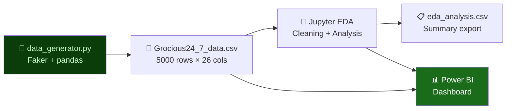

<div align="center">


<p>
  
  
  
  
  
  
</p>

<p>
  <a href="#-overview">Overview</a> •
  <a href="#-whats-unique">What's Unique</a> •
  <a href="#-dataset-schema">Schema</a> •
  <a href="#-categories--products">Categories</a> •
  <a href="#-eda-highlights">EDA</a> •
  <a href="#-power-bi-dashboard">Dashboard</a> •
  <a href="#-getting-started">Setup</a>
</p>

</div>

---

## 🛒 Overview

> **A complete retail analytics sandbox — dataset generation, EDA, and a Power BI dashboard built from scratch.**

**Grocious 24/7 Store** is a fictional 24-hour multi-category retail store. Unlike most analytics projects that rely on existing datasets, this project builds the data itself — a **custom Python data generator** using `Faker` produces 5,000 realistic order records across 7 product categories, 6 customer segments, 7 regions, and 5 payment modes.

```
data_generator.py  →  Grocious24_7_data.csv  →  Jupyter EDA  →  Power BI Dashboard
     (Faker)              (5,000 orders)        (26 columns)        (.pbix)
```

### Why This Project Stands Out
- 🏗️ **Built the data** — didn't just download it. Custom synthetic data generator with business logic
- 🔄 **Full pipeline** — generation → cleaning → EDA → visualization, all in one repo
- 📦 **26 columns** across sales, cost, profit, inventory, supplier, delivery, and payment data
- 🔁 **Regeneratable** — run `data_generator.py` anytime for a fresh dataset

---

## ✨ What's Unique

<details>
<summary><b>🏗️ Custom Data Generator — click to expand</b></summary>

<br/>

The `data_generator.py` script uses Python's `Faker` library to produce realistic retail data with genuine business logic baked in:

```python
# Smart auto-reorder logic
if stock_left < 10:
    auto_reorder = "Yes"
    reorder_quantity = random.randint(20, 50)
else:
    auto_reorder = "No"
    reorder_quantity = 0

# Realistic profit calculation
sales_amount = quantity * unit_price * (1 - discount / 100)
cost_price   = sales_amount * random.uniform(0.6, 0.9)
profit       = sales_amount - cost_price
```

**What makes it realistic:**
- Discount tiers at 0%, 5%, 10%, 15%, 20% (not random noise)
- Ship date always 1–7 days after order date
- Cost price ranges 60–90% of sales (realistic retail margins)
- Auto-reorder triggers at stock < 10 units
- Supplier names and emails generated via Faker

</details>

<details>
<summary><b>📊 26-Column Schema — widest dataset in this portfolio</b></summary>

<br/>

Most retail datasets have 10–15 columns. This one has **26** — covering the full lifecycle from order to delivery to supplier:

| Layer | Columns |
|-------|---------|
| 🛍️ Order | Order ID, Order Date, Ship Date |
| 👤 Customer | Customer Name, Customer ID, Customer Segment |
| 📦 Product | Product Name, Category, Product ID |
| 🌍 Geography | Region, Country, State, City |
| 💰 Financials | Quantity, Unit Price, Discount %, Sales Amount, Cost Price, Profit |
| 📦 Inventory | Stock Left, Auto Reorder, Reorder Quantity |
| 🏭 Supplier | Supplier Name, Supplier Email |
| 🚚 Fulfilment | Payment Mode, Delivery Status |

</details>

<details>
<summary><b>🔄 Fully Reproducible Pipeline</b></summary>

<br/>

Every part of this project can be run independently or end-to-end:

```
Step 1  →  python data_generator.py         # Generate fresh 5,000-row CSV
Step 2  →  jupyter notebook *.ipynb         # Run full EDA
Step 3  →  Open .pbix in Power BI Desktop   # Refresh data → dashboard updates
```

Change the `range(5000)` in `data_generator.py` to generate any volume — 10K, 50K, 100K rows.

</details>

---

## 🗂️ Dataset Schema

> **5,000 orders · 26 columns · 3-year date range**

```python
# Full column list from data_generator.py
{
  "Order ID"          : "ORD1000 → ORD5999",           # Unique order identifier
  "Order Date"        : "Date (last 3 years)",          # Random within past 3 years
  "Ship Date"         : "Order Date + 1–7 days",        # Realistic fulfilment window
  "Customer Name"     : "Faker.name()",                 # Realistic full name
  "Customer ID"       : "CUST100 → CUST999",            # 900 unique customers
  "Customer Segment"  : "6 segments (see below)",       # Buyer type classification
  "Product Name"      : "35 products across 7 categories",
  "Category"          : "7 categories (see below)",
  "Product ID"        : "PROD1000 → PROD9999",
  "Region"            : "7 regions (see below)",
  "Country"           : "Faker.country()",              # International dataset
  "State"             : "Faker.state()",
  "City"              : "Faker.city()",
  "Quantity"          : "1 – 10 units",
  "Unit Price"        : "₹100 – ₹5,000",
  "Discount (%)"      : "0, 5, 10, 15, or 20",          # Fixed discount tiers
  "Sales Amount"      : "Qty × UnitPrice × (1 - Disc%)",
  "Cost Price"        : "60–90% of Sales Amount",
  "Profit"            : "Sales Amount - Cost Price",
  "Stock Left"        : "0 – 50 units",
  "Auto Reorder"      : "Yes if Stock < 10, else No",   # Smart inventory logic
  "Reorder Quantity"  : "20–50 units (if reorder = Yes)",
  "Supplier Name"     : "Faker.company()",
  "Supplier Email"    : "Faker.company_email()",
  "Payment Mode"      : "5 modes (see below)",
  "Delivery Status"   : "Delivered / Pending / Cancelled / Returned"
}
```

---

## 🏪 Categories & Products

<details>
<summary><b>🛋️ Furniture — 5 products</b></summary>

| Product | Price Range | Notes |
|---------|-------------|-------|
| Office Chair | ₹500–₹5,000 | High volume, corporate segment |
| Bed | ₹1,000–₹5,000 | Largest unit price variance |
| Sofa | ₹800–₹5,000 | Returns skew higher |
| Bookshelf | ₹300–₹3,000 | Frequent reorders |
| Dining Table | ₹700–₹5,000 | Low quantity per order |

</details>

<details>
<summary><b>💻 Electronics — 5 products</b></summary>

| Product | Price Range | Notes |
|---------|-------------|-------|
| AC | ₹2,000–₹5,000 | Highest avg ticket |
| Mobiles | ₹1,500–₹5,000 | Highest demand category |
| Buds | ₹300–₹2,000 | Fast-moving, high reorder rate |
| Headphones | ₹500–₹3,000 | Corporate & VIP segment heavy |
| Projector | ₹1,000–₹5,000 | Low frequency, high margin |

</details>

<details>
<summary><b>📎 Office Supplies — 5 products</b></summary>
Pen · Sticky Notes · Notebook · Stapler · Ink — High volume, low unit price, bulk corporate orders
</details>

<details>
<summary><b>🥛 Grocery — 5 products</b></summary>
Milk · Bread · Eggs · Fruits · Vegetables — Highest order frequency, lowest margins, fastest shipping
</details>

<details>
<summary><b>👕 Clothing — 5 products</b></summary>
T-Shirt · Jeans · Jacket · Sneakers · Sweater — High return rate, seasonal patterns
</details>

<details>
<summary><b>🧸 Toys — 5 products</b></summary>
Action Figure · Board Game · Puzzle · Doll · RC Car — Q4 peak demand, gifting segment
</details>

<details>
<summary><b>💄 Beauty — 5 products</b></summary>
Face Wash · Moisturizer · Perfume · Lipstick · Shampoo — Repeat purchase, subscription-like behaviour
</details>

---

## 🔬 EDA Highlights

> Performed in `Grocious_24_7_Store_data.ipynb` — key findings from the 5,000-order dataset.

<details>
<summary><b>💰 Revenue & Profitability Analysis</b></summary>

- **Total Sales** — Aggregate revenue across all 5,000 orders
- **Profit Margin by Category** — Which of the 7 categories is most profitable?
- **Discount Impact** — How do the 5 discount tiers (0–20%) affect profit?
- **High-Value vs Low-Value Orders** — Distribution of order sizes

</details>

<details>
<summary><b>👤 Customer Segmentation Analysis</b></summary>

| Segment | Typical Behaviour |
|---------|-----------------|
| Consumer | High frequency, moderate ticket |
| Corporate | Bulk orders, negotiated discounts |
| Home Office | Regular reorders, Office Supplies heavy |
| VIP Member | High AOV, low discount sensitivity |
| Small Business | Mixed category, volume-driven |
| Wholesale | Largest quantities, lowest unit price |

</details>

<details>
<summary><b>🌍 Regional & Geographic Analysis</b></summary>

- **7 Regions** — North · South · East · West · Central · North-East · International
- Revenue and order volume broken down by region
- City-level order density mapping
- International vs domestic order comparison

</details>

<details>
<summary><b>📦 Inventory & Supply Chain Analysis</b></summary>

- **Auto-Reorder Rate** — What % of products triggered automatic restock?
- **Stock-Out Risk** — Products consistently below 10 units
- **Supplier Performance** — Orders per supplier, fulfilment reliability
- **Delivery Status Breakdown** — Delivered vs Pending vs Cancelled vs Returned

</details>

<details>
<summary><b>💳 Payment Mode Analysis</b></summary>

| Mode | Share | Avg Order Value |
|------|-------|----------------|
| UPI | ~28% | Moderate |
| Credit Card | ~22% | Highest |
| Debit Card | ~20% | Moderate |
| Net Banking | ~17% | High |
| Cash | ~13% | Lowest |

</details>

---

## 📊 Power BI Dashboard

The `Grocious24 7 Store.pbix` dashboard covers:

| Page | KPIs Tracked |
|------|-------------|
| 📋 **Executive Summary** | Total Sales, Total Profit, Profit Margin %, Total Orders |
| 🏪 **Category Performance** | Revenue & profit by all 7 categories |
| 👥 **Customer Analysis** | Segment breakdown, top customers, AOV |
| 🌍 **Regional View** | Order & revenue heatmap across 7 regions |
| 📦 **Inventory Monitor** | Stock-out alerts, auto-reorder status, supplier view |
| 💳 **Payment & Delivery** | Payment mode split, delivery status funnel |
| 📅 **Time Trends** | Daily / monthly / quarterly order volume & revenue |

**Slicers available:** Category · Region · Customer Segment · Payment Mode · Delivery Status · Date Range

---

## 📁 Project Structure

```
grocious-24-7-store/
│
├── 🐍 data_generator.py                   # Synthetic data generator (Faker + pandas)
├── 📄 Grocious24_7_data.csv               # Generated dataset — 5,000 orders × 26 columns
├── 📓 Grocious_24_7_Store_data.ipynb      # Full EDA notebook
├── 📊 Grocious24 7 Store.pbix             # Power BI dashboard
├── 📋 eda_analysis.csv                    # EDA summary export
└── 📖 README.md                           # You are here
```

---

## 🚀 Getting Started

### Prerequisites
```
Python 3.8+   |   Power BI Desktop   |   Jupyter Notebook
```

### 1. Clone the repository
```bash
git clone https://github.com/chayanshh/grocious-24-7-store.git
cd grocious-24-7-store
```

### 2. Install dependencies
```bash
pip install pandas numpy faker
```

### 3. Generate a fresh dataset (optional)
```bash
python data_generator.py
# Output: Grocious24_7_data.csv (5,000 rows × 26 columns)
```
> The CSV is already included in the repo. Run the generator only if you want a fresh sample or a different volume — change `range(5000)` to any number.

### 4. Run the EDA notebook
```bash
jupyter notebook Grocious_24_7_Store_data.ipynb
```

### 5. Open the Power BI Dashboard
Open `Grocious24 7 Store.pbix` in Power BI Desktop. If prompted to refresh, point the data source to your local `Grocious24_7_data.csv`.

---

## 🧩 Data Pipeline



---

## 🛠️ Tech Stack & Libraries

```
✅ pandas          Data manipulation and CSV I/O
✅ numpy           Numerical operations and random sampling
✅ Faker           Realistic synthetic data (names, companies, cities)
✅ datetime        Ship date calculation (Order Date + 1–7 days)
✅ random          Discount tiers, delivery status, payment mode sampling
✅ Power BI        Interactive dashboard with slicers and drill-through
✅ Jupyter         EDA, visualisation, and analysis notebook
```

---

## 🤝 Contributing

1. Fork the repository
2. Create a feature branch: `git checkout -b feature/add-returns-analysis`
3. Extend the data generator or notebook
4. Open a Pull Request

**Ideas for contributions:**
- Add seasonal demand patterns to the generator
- Build an SQL layer on top of the CSV
- Add a cohort analysis to the EDA notebook

---

## 👤 Author

**Chayansh Jain**
- GitHub: [@chayanshh](https://github.com/chayanshh)
- LinkedIn: [linkedin.com/in/chayanshh05](https://www.linkedin.com/in/chayanshh05)

---

<div align="center">


*Built with 🛒 Python · Faker · Pandas · Power BI*

</div>
